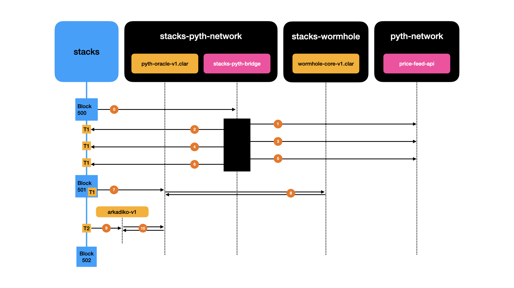

                      
       /     /   ▶ Stacks Pyth Bridge   
      / --- /      Bridging Pyth price feeds to the Stacks blockchain.
     /     /       Retrieve trading pairs (BTC-USD, STX-USD, etc.) from Clarity smart contracts. 
                  

&nbsp;&nbsp;&nbsp;&nbsp;&nbsp;&nbsp;&nbsp;&nbsp;&nbsp;&nbsp;&nbsp;&nbsp;&nbsp;&nbsp;&nbsp;&nbsp;&nbsp;&nbsp;&nbsp;&nbsp;&nbsp;&nbsp;&nbsp;&nbsp;&nbsp;&nbsp;&nbsp;&nbsp;&nbsp;&nbsp;&nbsp;&nbsp;&nbsp;&nbsp;&nbsp;[](#Introduction)
&nbsp;&nbsp;&nbsp;&nbsp;[](#Features)
&nbsp;&nbsp;&nbsp;&nbsp;[](#Quick-start)
&nbsp;&nbsp;&nbsp;&nbsp;[](#Documentation)
&nbsp;&nbsp;&nbsp;&nbsp;[](#Contribute)

***

# Introduction

**Status**: **Developer Preview**

This initial release is a Developer Preview of the Stacks x Pyth integration. The integration is live on both the testnet and mainnet networks to help developers test, give feedback, and ensure the reliability and stability of the integration.

[Stacks](http://stacks.co) is a blockchain linked to Bitcoin by its consensus mechanism that spans the two chains, called Proof of Transfer. This enables Stacks to leverage Bitcoin’s security and enables Stacks apps to use Bitcoin’s state.
Stacks is a Bitcoin layer that enables decentralized apps and smart contracts.

[Pyth Network](https://pyth.network) is an oracle that publishes financial market data to multiple blockchains. The market data is contributed by over 80 first-party publishers, including some of the biggest exchanges and market-making firms in the world. Pyth offers price feeds for several asset classes, including US equities, commodities, and cryptocurrencies. Each price feed publishes a robust aggregate of publisher prices that updates multiple times per second.
Price feeds are available on multiple blockchains and can be used in off-chain applications.

[Wormhole](https://wormhole.com) is a decentralized attestation engine that leverages its network of guardians to trustlessly bridge information between the chains it supports. Wormhole has a simple, elegant, and pragmatic design that has enabled it to be the first real solution to ship to market and has received wide recognition and support from its member chains.

## Setup and Test a Devnet Bridge

The bridge is being operated through an off-chain service, `stacks-path-relayer`, and a set of contracts implementing the core functionalities specified by the Wormhole protocol. 

The contracts are developed in Clarity and use Clarinet for its test harnessing.
This guide assumes that a recent installation of Clarinet (available on brew and winget) is available locally. 

Git clone and compile **stacks-pyth-relayer**

```bash
$ git clone https://github.com/hirosystems/stacks-pyth-bridge.git
$ cd stacks-pyth-bridge
```

Start a local Devnet using the command:
```bash
$ clarinet integrate
```

In another console, the service can be compiled and installed using the command:

```bash
$ cd stacks-pyth-bridge/relayer
$ cargo install --path .
```

Once installed, a config can be generated using the command:

```bash
$ stacks-pyth-relayer config new
```

A typical valid config looks like this:

```toml
[pyth]
network = "mainnet"
price_service_url = "https://xc-mainnet.pyth.network"
price_feeds_ids = [
    # "0xf9c0172ba10dfa4d19088d94f5bf61d3b54d5bd7483a322a982e1373ee8ea31b", # BTC-USD (testnet)
    # "0xc2703fcc925ad32b6256afc3ebad634970d1b1ffb3f4143e36b2d055b1dcd29b", # STX-USD (testnet)
    "0xe62df6c8b4a85fe1a67db44dc12de5db330f7ac66b72dc658afedf0f4a415b43", # BTC-USD (mainnet)
]
# Price feed IDs available here: https://pyth.network/developers/price-feed-ids

[stacks]
network = "devnet"
stacks_node_rpc_url = "http://localhost:20443"
pyth_oracle_contract_address = "ST1PQHQKV0RJXZFY1DGX8MNSNYVE3VGZJSRTPGZGM.pyth-price-feed-oracle-v1"
mnemonic = "prevent gallery kind limb income control noise together echo rival record wedding sense uncover school version force bleak nuclear include danger skirt enact arrow"
derivation_path = "m/44'/5757'/0'/0/0"
start_block = 6

[bridge]
price_updates_per_minute = 5
enable_rbf = true
enable_microblocks = true

[event_observer]
ingestion_port = 20456
```

After reviewing the generated config, the service can be tested using the command:

```bash
$ stacks-pyth-relayer service ping --config-path Bridge.toml
```

After validating that the service can connect to the Price API service and the Stacks chain, the service can be run with the command:

```bash
$ stacks-pyth-relayer service start --config-path Bridge.toml
```

The operator will start fetching prices from the Pyth network Price API and submit these Verified Action Attestations to the Pyth contract. The Pyth contract submits these VAAs to the wormhole contract, ensuring the guardians correctly sign the payloads.




## How to consume the price feeds

### Latest Version

| network | address |
|---------|---------------------------------------------------------------------|
| testnet | ST2J933XB2CP2JQ1A4FGN8JA968BBG3NK3EPXFQFR.pyth-oracle-dev-preview-1 |
| mainnet | SP2J933XB2CP2JQ1A4FGN8JA968BBG3NK3EKZ7Q9F.pyth-oracle-dev-preview-1 |


### Onchain

The `pyth-oracle-v1` contract is exposing the following read-only method:

```clarity
(define-read-only (read-price-feed 
    (price-feed-id (buff 32))))
```
 
That can be consumed with the following invocation:

```clarity
(contract-call? 
    'ST1PQHQKV0RJXZFY1DGX8MNSNYVE3VGZJSRTPGZGM.pyth-oracle-v1  ;; Address of the oracle contract
    read-price-feed
    0xf9c0172ba10dfa4d19088d94f5bf61d3b54d5bd7483a322a982e1373ee8ea31b)
```

The authenticity of the price feeds is verified during their ingestion, making the cost of queries as light as possible.

Each Pyth Network price feed is referred to via a unique ID. Price feeds also have different IDs in mainnets than testnets or devnets. The full list of price feeds is listed on the [pyth.network website](https://pyth.network/price-feeds/). The price feed IDs page lists the ID of each available price feed on every chain where they are available. To use a price feed on-chain, look up its ID using these pages, then store the feed ID in your program for price feed queries.

Price Feeds usage and best practices are described on the [pyth.network developer documentation website](https://docs.pyth.network/pythnet-price-feeds/best-practices). 


#### Prices currently supported on Testnet

| Pair    | Price Feed ID |
|---------|--------------------------------------------------------------------|
| STX-USD | 0xec7a775f46379b5e943c3526b1c8d54cd49749176b0b98e02dde68d1bd335c17 |

#### Prices currently supported on Mainnet

| Pair    | Price Feed ID |
|---------|--------------------------------------------------------------------|
| STX-USD | 0xec7a775f46379b5e943c3526b1c8d54cd49749176b0b98e02dde68d1bd335c17 |
| BTC-USD | 0xe62df6c8b4a85fe1a67db44dc12de5db330f7ac66b72dc658afedf0f4a415b43 |
| ETH-USD | 0xff61491a931112ddf1bd8147cd1b641375f79f5825126d665480874634fd0ace |

Feel free to open an issue on this repo if more prices are required for your application. The full list of prices is available [here](https://pyth.network/price-feeds/).

### Offchain

For every new price recorded and stored on chain, the `pyth-oracle-v1` is emitting an event with the following shape:

```clarity
(print { 
    type: "price-feed", 
    action: "updated", 
    data: { 
        attestation-time: u1686854317, 
        conf: u2064471426, 
        ema-conf: u1891952230, 
        ema-price: 2507095440000, 
        expo: 4294967288, 
        prev-conf: u2064471426, 
        prev-price: 2515455528574, 
        prev-publish-time: u1686854316, 
        price: 2515455528574, 
        publish-time: u1686854317, 
        status: u1
     } })
```

These events can be observed using [Chainhook](https://github.com/hirosystems/chainhook), using the `print` predicates.

## Todos:

- [ ] Resolve todos, mostly aiming at adding more checks in both wormhole and pyth contracts
- [ ] Address insufficient test coverage
- [ ] Resolve build warnings
- [ ] Improve documentation
- [ ] Add example
